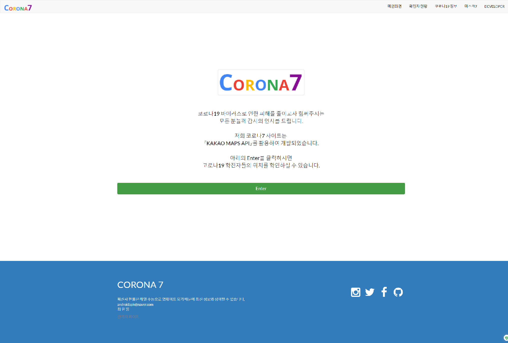
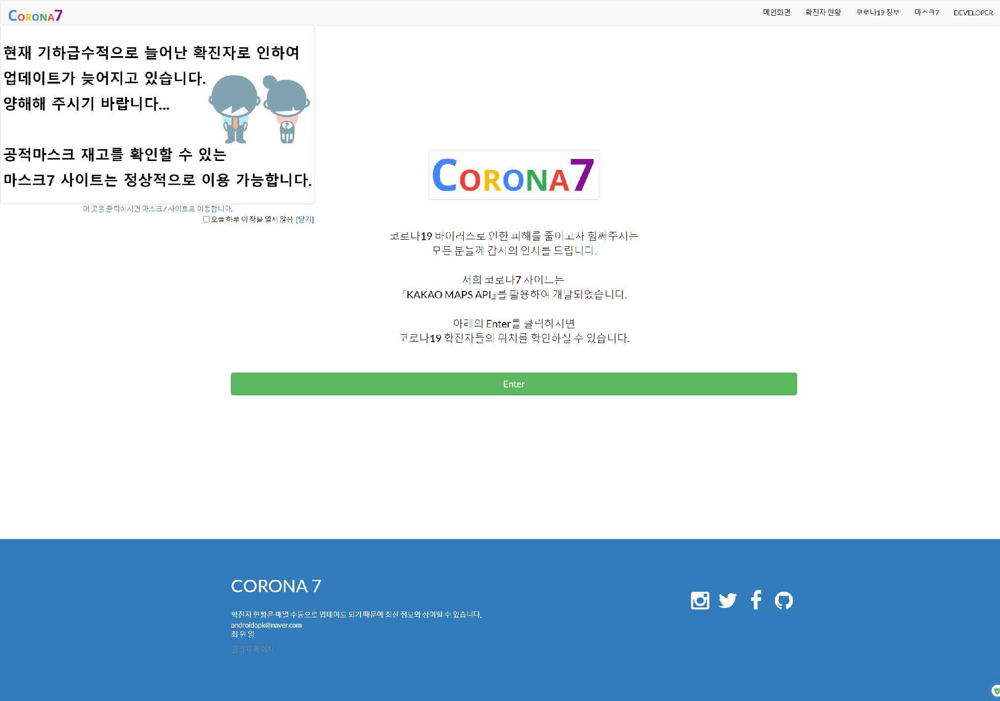
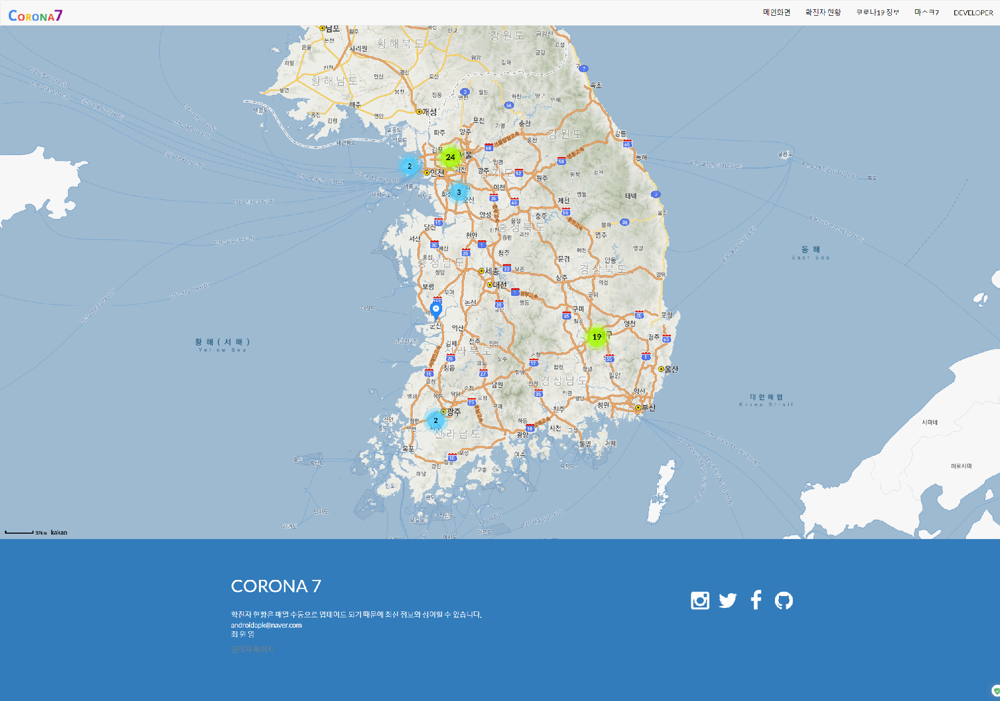
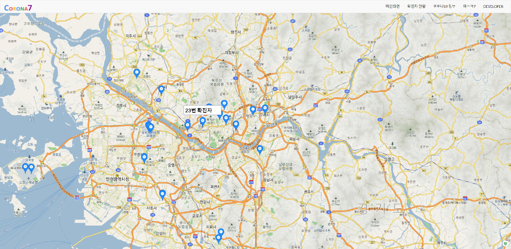
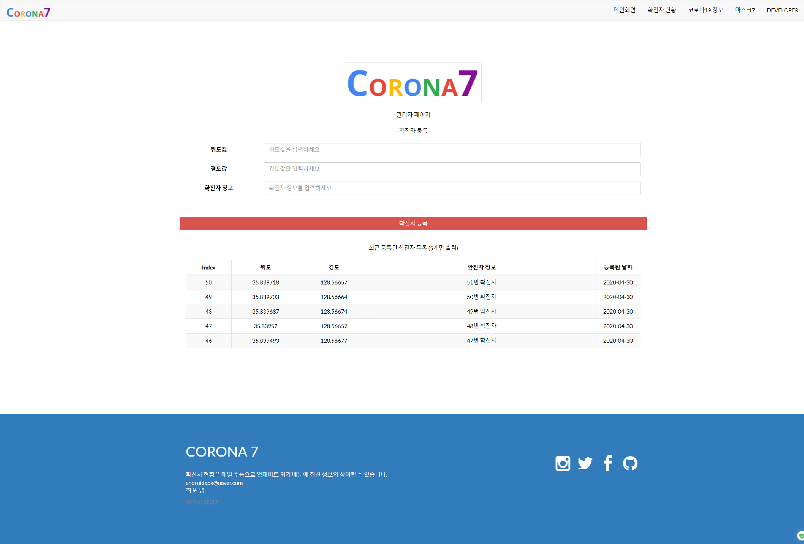
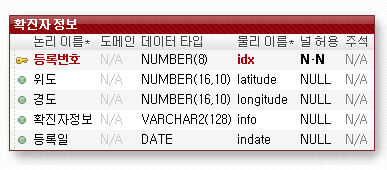

# Corona7
----------------
## 1. 목차
```
.CORONA7 코로나19 확진자 정보 사이트
├── 1.목차
├── 2.URL
├── 3.개요
├── 4.특징
├── 5.사용법
|   ├── 5.1.개발 환경 & 개발 툴
|   └── 5.2.실행 방법
|       ├── 5.2.1 실행 환경 세팅
|       └── 5.2.2 실행
└── 6.스크린샷
    ├── 6.1.메인 화면
    ├── 6.2.레이어 팝업 화면
    ├── 6.3.확진자 위치 화면
    ├── 6.4.확진자 정보 화면
    ├── 6.5.코로나19 정보 화면
    ├── 6.6.관리자 페이지 화면
    └── 6.7.데이터베이스 테이블 화면
```

## 2. URL 
# http://0254.duckdns.org:9090/corona7


## 3. 개요
 - **Spring Framework**로 구현한 **MVC패턴의 코로나19 확진자 정보 사이트**입니다. 
 - 사이트에는 확진자 위치, 코로나19 정보, 개발자 정보 등의 기능이 구현되어 있습니다.
 - Maven, MyBatis, Log4j, Lombok, 카카오 API, 구글 API 등 다양한 라이브러리 및 유틸리티를 활용하였습니다. 
 
 
 
## 4. 특징
- KaKao Maps API를 이용하여 코로나19 확진자를 지도에 표시하여 마우스 커서를 대면 확진자 정보를 출력합니다.
- 관리자만 이용할 수 있는 전용 페이지를 만들어 확진자 위치에 대한 좌표값을 넣어 확진자 정보를 추가할 수 있습니다.
- 확진자의 정보는 DB에 저장된 좌표값을 바탕으로 지도에 해당 위치가 출력됩니다.
- Developer 부분에는 구글 지도를 사용하는 api를 사용했습니다.
- 레이어 팝업을 적용하여 메인페이지에서 팝업을 띄우게 하였고 쿠키를 생성하여 일정 기간동안 팝업을 띄우지 않도록 했습니다.
- 반응형 웹페이지로 PC와 MOBILE등 각 기기에 맞도록 최적화된 화면을 보여줍니다.
- aws로 구동하며 도메인을 이용하여 어디에서나 http://0254.duckdns.org:9090/corona7 을 입력하면 접속이 가능하도록 하였습니다.


## 5. 사용법
### 5.1. 개발 환경 & 개발 툴
- Programing Language : HTML, CSS, JavaScript, jQuery, Java 8, JSP, Servlet
- Framework : Bootstrap, Spring 5.0.7, MyBatis
- Database : Oracle Database 11g Express
- API : KaKao Maps API, Google Maps JavaScript API
- Server : Apache Tomcat 8.5
- OS: Windows 10 
-----------------------------------------------------------------------------
- Tool : Spring Tool Suite, VS code
- DB Modeling Tool : Exerd
- Graphic Tool : Adobe Photoshop CC


### 5.2. 실행 방법
#### 5.2.1 실행환경 세팅
```
# 1. Spring Tool Suite에 해당 Corona7프로젝트를 import 합니다.
- ojdbc6.jar 파일이 lib 폴더에 포함되어 있습니다. 
# 2. src/main/resources/DDL 폴더에 있는 SQL 파일로 테이블을 만드시기 바랍니다. 
- 총 1개의 테이블이 있습니다.
# 3. JNDI설정을 확인하여 DB Connection 여부를 확인하시기 바랍니다.
- jndiDataSource를 참조하지 않으신다면 dataSource bean을 해당 컴퓨터의 설정에 맞게 수정하여 sqlSessionFactoryBean의 property를 jndiDataSource에서 dataSource로 수정하시기 바랍니다.
# 4. kakao developers에 새로운 애플리케이션을 추가해 주신 후 앱 키를 받아 list.jsp에 있는 16번째 줄의 appkey부분을 수정하시기 바랍니다.
# 5. kakao developers의 플랫폼에서 사이트 도메인을 추가해 주시기 바랍니다.
# 4. 이렇게 하면 세팅은 완료됩니다.
```
#### 5.2.2 실행
```
# 1. 설정이 완료되면 server를 시작하고, 웹 사이트 주소 창에 http://localhost:8080/corona7을 입력하시면 됩니다. 
- 포트 번호(8080)는 본인의 컴퓨터에 설정된 톰캣의 포트번호로 변경해주시기 바랍니다. 
# 2. 관리자 코드를 입력하시면 관리자 페이지로 들어가지고 확진자 정보를 추가할 수 있습니다.
```


## 6. 스크린샷

### 6.1.메인 화면
 
 -------------

### 6.2. 레이어 팝업 화면
 
 -------------
 
 ### 6.3. 확진자 위치 화면
 
 -------------
  
 ### 6.4. 확진자 정보 화면
 
 -------------
  
 ### 6.5. 코로나19 정보 화면
 
 -------------
  
 ### 6.6. 관리자 페이지 화면
 
 -------------
  
 ### 6.7. 데이터베이스 테이블 화면
 
 -------------


-----------------------------------------------------------------------------
# 감사합니다!
